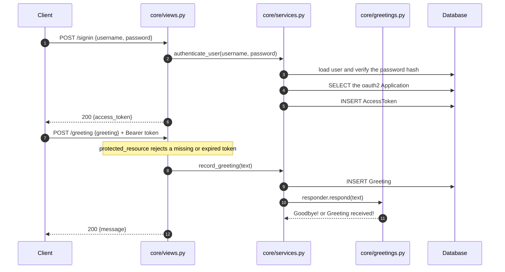

# GreetingApi

A Django JSON API with exactly two calls: sign in for an OAuth2 bearer token,
then post a greeting. Every greeting is stored. Greet it with "hello" and it
answers `Goodbye!`; anything else gets `Greeting received!`. That is the whole
specification — what is worth reading is how a two-endpoint service is wired,
validated and tested, not the feature list.

The directory is named `ibl_education`, a name that appears nowhere in the
code. The project calls itself `GreetingApi`.

## The two calls it answers

| Method | Path | Auth | Body | Success |
| --- | --- | --- | --- | --- |
| `POST` | `/signin` | none | `{"username", "password"}` | `200 {"access_token": "..."}` |
| `POST` | `/greeting` | Bearer token | `{"greeting": "..."}` | `200 {"message": "..."}` |
| `GET` | `/healthz` | none | — | `200 {"status", "database"}` |

`/o/` mounts django-oauth-toolkit's own endpoints and `/admin/` the Django
admin. Neither is part of this API's contract, and `/healthz` exists for the
container `HEALTHCHECK` rather than for clients.

Failures are always `{"error": "..."}`: `400` for a malformed body, a body that
is valid JSON but not an object, a missing/blank/non-string field, or bad
credentials; `403` for a missing or expired token; `405` for anything but
`POST`; `503` when no OAuth2 `Application` row exists to issue tokens against.

Literal output from a `runserver` session — the full nine-step session with
headers is in [`docs/api-transcript.md`](docs/api-transcript.md):

```console
$ curl -s -X POST http://127.0.0.1:8730/signin \
    -H 'Content-Type: application/json' \
    -d '{"username": "demo", "password": "demo-pass-9876"}'
{"access_token": "JbQuC0nBzdCxKvn1cfUecS7IYfV2hF"}

$ curl -s -X POST http://127.0.0.1:8730/greeting \
    -H "Authorization: Bearer $TOKEN" -H 'Content-Type: application/json' \
    -d '{"greeting": "  HELLO  "}'
{"message": "Goodbye!"}

$ curl -s -X POST http://127.0.0.1:8730/greeting \
    -H "Authorization: Bearer $TOKEN" -H 'Content-Type: application/json' \
    -d '{"greeting": "good morning"}'
{"message": "Greeting received!"}

$ curl -s -X POST http://127.0.0.1:8730/greeting \
    -H 'Content-Type: application/json' -d '{"greeting": "Hello"}'
{"error": "A valid bearer token is required"}
```

Matching is on the whole string after stripping surrounding whitespace and
folding case, which is why `"  HELLO  "` hits the rule. `"hello there"` does
not.

## From credentials to a stored row



Dependencies only point inward. `core/views.py` is 58 lines of adapter — parse,
call one service, shape the response — with the body parsing, method guard and
error envelope factored into `core/http.py`. `core/services.py` imports nothing
from `django.http`, so its three use cases are tested without building a
request; `core/greetings.py` imports nothing from Django at all and is tested
with `SimpleTestCase`. Failures are `ApiError` subclasses in `core/errors.py`
carrying their own status codes, so a new failure mode is a class rather than
another `if` in a view.

Persistence is one table: `Greeting`, holding the text and a `created_at`
timestamp with a descending index, since every read of it is "most recent
first" and that is the column a retention job would filter on.

`POST /greeting` costs two queries, a token lookup and the insert, pinned by
`assertNumQueries(2)` in `test_the_request_costs_a_token_lookup_and_one_insert`
and `assertNumQueries(1)` on the service itself. With PostgreSQL,
`CONN_MAX_AGE` defaults to 60 seconds rather than Django's 0. There is no
cache — nothing reads the table back — no queue, and no orchestration.

## Running it

```bash
python3 -m venv .venv
.venv/bin/pip install -r requirements.txt
cp .env.example .env                        # DJANGO_DEBUG=1, no secret needed

.venv/bin/python manage.py migrate
.venv/bin/python manage.py createsuperuser

# Tokens are issued against an oauth2_provider Application. Create one.
.venv/bin/python manage.py createapplication \
    confidential password --name "GreetingApi Client"

.venv/bin/python manage.py runserver 8000
```

Then sign in as that user and post a greeting as shown above, against
`127.0.0.1:8000`.

`docker compose up --build` brings up PostgreSQL 16 and the API on host port
8730 instead; `DJANGO_SECRET_KEY` and `DJANGO_DB_PASSWORD` must be set in
`.env` first — compose uses `${VAR:?}` syntax so it fails loudly rather than
booting on a blank secret — and `createapplication` still has to be run once
inside the container.

For development, `pip install -r requirements-dev.txt` then `make test`,
`make coverage`, `make lint`, `make format` or `make check`. The suite needs no
configuration and no network: it runs on in-memory SQLite, generates a
throwaway secret key when it detects the test runner, and makes no outbound
calls.

## Configuration

Every deployment value is read from the environment.
`GreetingApi/settings.py` also loads a `.env` file next to `manage.py` if one
exists, and a real environment variable always wins over the file.
[`.env.example`](.env.example) lists all of them; the ones that change
behaviour rather than just a hostname are:

| Variable | Default | Effect |
| --- | --- | --- |
| `DJANGO_SECRET_KEY` | — | Required once `DJANGO_DEBUG` is off: startup raises `ImproperlyConfigured` rather than falling back to a predictable key. With debug on, a per-process throwaway key is generated. |
| `DJANGO_DEBUG` | `0` | Off by default. Turning it off is also what enables the HSTS, SSL-redirect and secure-cookie block. |
| `DJANGO_ALLOWED_HOSTS` | `localhost,127.0.0.1,[::1]` | Comma-separated. Never `*`. |
| `DJANGO_DB_ENGINE` | `sqlite` | `sqlite` or `postgres`. Any other value is rejected at startup. |
| `OAUTH2_ACCESS_TOKEN_TTL_HOURS` | `1` | Lifetime of a token minted by `/signin`. |
| `OAUTH2_APPLICATION_NAME` | unset | Which `Application` row tokens are issued against. Unset means the lowest-numbered one. |

`env_bool`, `env_int` and `env_list` raise `ImproperlyConfigured` on input they
cannot parse, so a typo in `DJANGO_DB_PORT` fails at boot rather than at the
first query. Nothing sensitive is in the source, and
`test_no_secret_key_is_baked_into_the_source` asserts that no
`django-insecure-` literal can reappear in the settings module.

## Where a new reply goes

The one thing anyone is realistically going to change about this service is
what it says back, so that is the only seam. `core/greetings.py` is an ordered
registry consulted in registration order — the first rule to return a string
wins, `None` declines and falls through, and an empty run uses the default
reply:

```python
@responder.rule
def bonjour(text):          # text arrives stripped and case-folded
    return "Salut !" if text == "bonjour" else None
```

No view, service, URL or model changes. There is deliberately no plugin
system, no abstraction over the database and no configuration DSL.

## Evidence in the repository

- [`docs/test-run.txt`](docs/test-run.txt) — literal `ruff`, `manage.py test`,
  `coverage report`, `makemigrations --check` and `check --deploy` output: 68
  tests, 100% statement coverage of 254 statements, no lint findings, no
  pending migrations.
- [`docs/mutation-check.md`](docs/mutation-check.md) — the suite with three of
  the guarded defects put back, failing across 12 tests, then passing once they
  are restored. A suite that cannot fail proves nothing.
- [`docs/api-transcript.md`](docs/api-transcript.md) — the session above in
  full, ending with the rows that were actually persisted.

The suite is split by layer: the registry with no database, models, services
with a database but no HTTP, settings and env parsing, and the two view modules
including an end-to-end sign-in-then-greet journey.

## Known gaps

- **`/signin` is not a real OAuth2 grant.** It mints a bearer token directly,
  so there is no refresh token and no way for a client to hand one back. A
  token is valid until it expires. django-oauth-toolkit's own endpoints at
  `/o/` are the right thing for a real client.
- **No rate limiting on `/signin`.** Nothing slows credential guessing. That
  belongs in front of the application, or in `django-ratelimit`.
- **Nothing prunes anything.** `core_greeting` and
  `oauth2_provider_accesstoken` are append-only. The index and
  `manage.py cleartokens` exist; a scheduler does not.
- **Greetings are write-only.** No list endpoint and no aggregation — the table
  is readable only through the Django admin. SQLite also serialises writers,
  which is why the PostgreSQL path exists.
- **A `Profile` model was dropped.** Migration `0001` creates a `Profile` with
  `bio`, `location` and a `profileimg` image field; migration `0002` deletes
  it. Nothing in the code reads or writes it, and its `ImageField` makes
  `manage.py check` fail outright without Pillow installed. If user profiles
  were meant to be in scope they need building from a specification, not
  reviving a stub.
- **The container images are unbuilt.** `Dockerfile` and `docker-compose.yml`
  have been parse-checked with `docker compose config`; they have not been
  built or booted.
