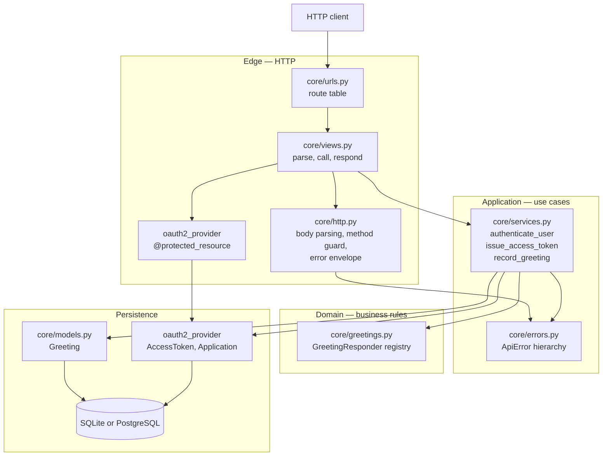
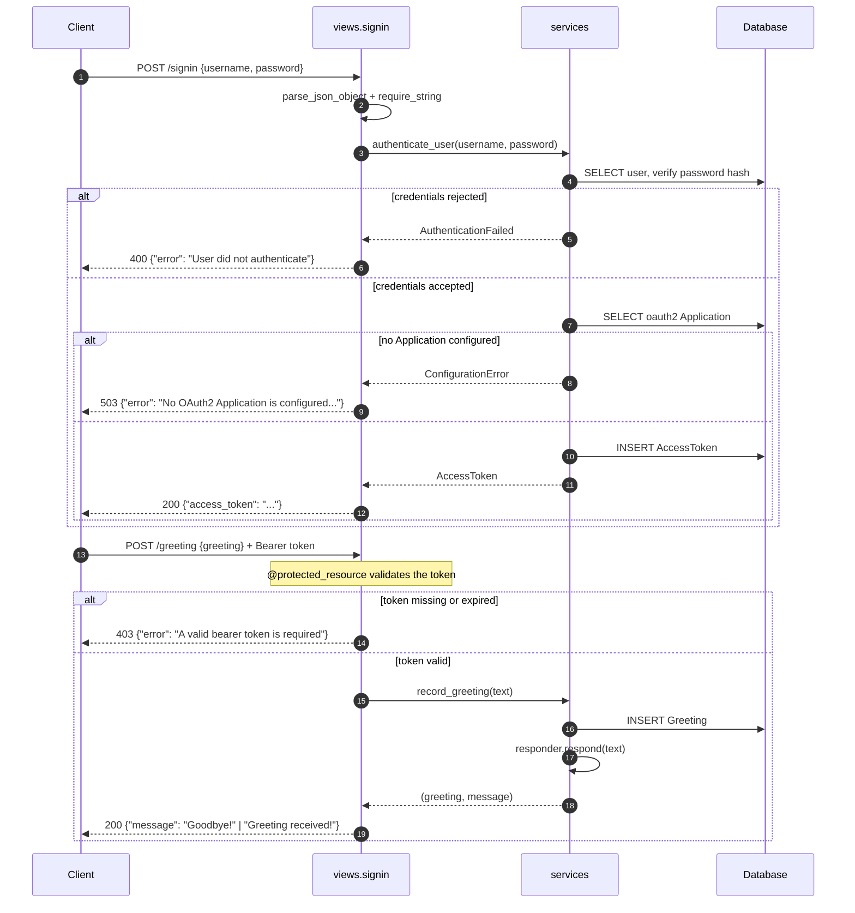

# GreetingApi

A small Django JSON API that records greetings and answers them. A client
signs in with a username and password at `POST /signin`, receives an OAuth2
bearer token, and uses that token to `POST /greeting`. Every greeting is
persisted; greeting the service with "hello" is answered `Goodbye!`, anything
else gets `Greeting received!`.

It is deliberately small — one app, two endpoints and a health check. The
value on show is the layering, the validation and the test suite rather than
the feature list.

## Captured output

There is no user interface, so nothing is screenshotted. The transcript below
is real output from `manage.py runserver 127.0.0.1:8730` against a seeded
SQLite database; the full session, including headers and error cases, is in
[`docs/api-transcript.md`](docs/api-transcript.md).

```console
$ curl -s -X POST http://127.0.0.1:8730/signin \
    -H 'Content-Type: application/json' \
    -d '{"username": "demo", "password": "demo-pass-9876"}'
{"access_token": "JbQuC0nBzdCxKvn1cfUecS7IYfV2hF"}

$ curl -s -X POST http://127.0.0.1:8730/greeting \
    -H "Authorization: Bearer $TOKEN" \
    -H 'Content-Type: application/json' \
    -d '{"greeting": "Hello"}'
{"message": "Goodbye!"}

$ curl -s -X POST http://127.0.0.1:8730/greeting \
    -H "Authorization: Bearer $TOKEN" \
    -H 'Content-Type: application/json' \
    -d '{"greeting": "good morning"}'
{"message": "Greeting received!"}

$ curl -s -i -X POST http://127.0.0.1:8730/greeting \
    -H 'Content-Type: application/json' \
    -d '{"greeting": "Hello"}'
HTTP/1.1 403 Forbidden
Content-Type: application/json

{"error": "A valid bearer token is required"}
```

Test, lint and coverage output is in [`docs/test-run.txt`](docs/test-run.txt),
and [`docs/mutation-check.md`](docs/mutation-check.md) shows the suite failing
when the defects it guards against are put back.

## Architecture

Layered, with dependencies pointing inward. HTTP concerns live at the edge;
the domain rule at the centre knows nothing about Django's request object.



Read the arrows as "depends on". `core/greetings.py` imports nothing from
Django, `core/services.py` imports nothing from `django.http`, and
`core/views.py` contains no business rules.

## Workflow

The main flow, from credentials to a persisted greeting:



## Quickstart

```bash
python3 -m venv .venv
.venv/bin/pip install -r requirements.txt

cp .env.example .env          # DJANGO_DEBUG=1, no secret key needed

.venv/bin/python manage.py migrate
.venv/bin/python manage.py createsuperuser

# Tokens are issued against an oauth2_provider Application; create one.
.venv/bin/python manage.py createapplication \
    confidential password --name "GreetingApi Client"

.venv/bin/python manage.py runserver 8000
```

Then:

```bash
TOKEN=$(curl -s -X POST http://127.0.0.1:8000/signin \
  -H 'Content-Type: application/json' \
  -d '{"username": "<your user>", "password": "<your password>"}' \
  | sed -E 's/.*"access_token": "([^"]+)".*/\1/')

curl -s -X POST http://127.0.0.1:8000/greeting \
  -H "Authorization: Bearer $TOKEN" \
  -H 'Content-Type: application/json' \
  -d '{"greeting": "Hello"}'
```

With Docker, `docker compose up --build` brings up PostgreSQL and the API on
port 8730; `DJANGO_SECRET_KEY` and `DJANGO_DB_PASSWORD` must be set in `.env`
first, and the `createapplication` step above still has to be run once inside
the container.

### Endpoints

| Method | Path        | Auth         | Body                       | Success            |
| ------ | ----------- | ------------ | -------------------------- | ------------------ |
| `GET`  | `/healthz`  | none         | —                          | `200 {status, database}` |
| `POST` | `/signin`   | none         | `{"username", "password"}` | `200 {access_token}` |
| `POST` | `/greeting` | Bearer token | `{"greeting"}`             | `200 {message}`    |
| —      | `/o/...`    | —            | —                          | django-oauth-toolkit's own endpoints |
| —      | `/admin/`   | session      | —                          | Django admin       |

Errors are always `{"error": "..."}`: `400` for a malformed body, a body that
is not a JSON object, or a missing/blank/non-string field; `400` for bad
credentials; `403` for a missing or expired token; `405` for a non-POST; `503`
when no OAuth2 Application exists.

## Configuration

Every value is read from the environment. `GreetingApi/settings.py` also loads
a `.env` file next to `manage.py` if one exists, and a real environment
variable always wins over the file.

| Variable | Required | Default | Purpose |
| -------- | -------- | ------- | ------- |
| `DJANGO_SECRET_KEY` | Yes, unless `DJANGO_DEBUG` is on | — | Django signing key. With debug off and this unset the app refuses to start; with debug on a throwaway key is generated per process. |
| `DJANGO_DEBUG` | No | `0` (off) | Django debug mode. Off by default, which is the safe direction. |
| `DJANGO_ALLOWED_HOSTS` | No | `localhost,127.0.0.1,[::1]` | Comma-separated `ALLOWED_HOSTS`. Never `*`. |
| `DJANGO_LOG_LEVEL` | No | `INFO` (`CRITICAL` under the test runner) | Root and `django` logger level. |
| `DJANGO_DB_ENGINE` | No | `sqlite` | `sqlite` or `postgres`. Anything else is rejected at startup. |
| `DJANGO_DB_NAME` | No | `<repo>/db.sqlite3`, or `greetingapi` for postgres | Database file path or name. |
| `DJANGO_DB_USER` | Postgres only | `greetingapi` | Database user. |
| `DJANGO_DB_PASSWORD` | Postgres only | empty | Database password. |
| `DJANGO_DB_HOST` | Postgres only | `localhost` | Database host. |
| `DJANGO_DB_PORT` | No | `5432` | Database port. Must parse as an integer. |
| `DJANGO_DB_CONN_MAX_AGE` | No | `60` | Seconds a database connection is reused. |
| `OAUTH2_ACCESS_TOKEN_TTL_HOURS` | No | `1` | Lifetime of a token minted by `/signin`. |
| `OAUTH2_APPLICATION_NAME` | No | unset | Name of the `Application` row tokens are issued against. Unset means the lowest-numbered application. |
| `DJANGO_SECURE_SSL_REDIRECT` | No | `1` when debug is off | Redirect HTTP to HTTPS. Read only when debug is off. |
| `DJANGO_SECURE_HSTS_SECONDS` | No | `31536000` | `Strict-Transport-Security` max-age. Read only when debug is off. |

## Development

```bash
.venv/bin/pip install -r requirements-dev.txt

make test        # DJANGO_DEBUG=1 python manage.py test
make coverage    # the same suite under coverage, then the report
make lint        # ruff check . && ruff format --check .
make format      # apply safe fixes and formatting
make check       # lint + test
```

The suite needs no configuration and no network: it runs on an in-memory
SQLite database, generates its own secret key when it detects the test runner,
and makes no outbound calls. It was verified with `socket.connect`,
`socket.getaddrinfo` and `socket.create_connection` patched to raise.

`manage.py check --deploy` reports no issues when `DJANGO_SECRET_KEY` and a
real `DJANGO_ALLOWED_HOSTS` are set and debug is off; the run is in
`docs/test-run.txt`.

Formatting and linting are `ruff`, configured in `pyproject.toml`: 100-column
lines, pycodestyle, pyflakes, isort, bugbear, pyupgrade, comprehensions and
flake8-django rules.

## Project structure

```
.
├── GreetingApi/                      # Project configuration
│   ├── settings.py                   #   env-driven settings, .env loader
│   ├── urls.py                       #   admin + core routes
│   ├── wsgi.py / asgi.py
├── core/                             # The single application
│   ├── greetings.py                  #   DOMAIN: greeting rule registry
│   ├── services.py                   #   APPLICATION: the three use cases
│   ├── errors.py                     #   ApiError hierarchy → HTTP status
│   ├── http.py                       #   EDGE: body parsing, guards, envelope
│   ├── views.py                      #   EDGE: thin adapters only
│   ├── urls.py
│   ├── models.py                     #   Greeting
│   ├── admin.py
│   ├── migrations/
│   └── tests/                        #   68 tests, one module per concern
│       ├── support.py                #     shared fixtures
│       ├── test_greetings.py         #     registry, no DB
│       ├── test_models.py
│       ├── test_services.py          #     use cases, DB, no HTTP
│       ├── test_settings.py          #     env parsing and safe defaults
│       ├── test_signin_view.py
│       └── test_greeting_view.py     #     including the end-to-end journey
├── docs/                             # Captured evidence
│   ├── api-transcript.md             #   real request/response session
│   ├── test-run.txt                  #   real lint, test and coverage output
│   └── mutation-check.md             #   proof the suite can fail
├── Dockerfile                        # multi-stage, non-root, healthcheck
├── docker-compose.yml                # API + PostgreSQL
├── requirements.txt                  # runtime dependencies
├── requirements-dev.txt              # + ruff, coverage
├── pyproject.toml                    # ruff and coverage configuration
├── Makefile
└── .env.example
```

## Design notes

**Layering.** The original code put everything in two view functions: JSON
parsing, password checking, token minting and the greeting rule. They are now
four modules with a one-way dependency chain — `views → services → greetings /
models`. The payoff is testability: `core/greetings.py` is covered by
`SimpleTestCase` with no database at all, and `core/services.py` is covered
without constructing a request. Only `test_signin_view.py` and
`test_greeting_view.py` speak HTTP.

**The one extension seam.** The only thing a future developer is likely to
change is what the service says back. `core/greetings.py` is an ordered
registry: a new reply is a function decorated with `@responder.rule` that
returns a string or `None` to decline, and nothing in the HTTP or persistence
layers is touched. That is the single seam; there is no plugin system, no
provider abstraction over the database, and no configuration DSL, because
nothing here needs one.

**Errors as domain objects.** Services raise `ApiError` subclasses that carry
their own status code; `json_post_endpoint` turns any of them into
`{"error": ...}` with that status. Adding a failure mode is one class, not a
new `if` in a view. It also means the service layer never imports
`django.http`.

**Configuration.** Nothing sensitive is in the source. `DJANGO_DEBUG` defaults
*off* and `ALLOWED_HOSTS` defaults to loopback, so the unsafe configuration has
to be asked for explicitly rather than inherited by forgetting. With debug off
and no `DJANGO_SECRET_KEY`, startup fails loudly instead of running on a
predictable key. A test asserts that no `django-insecure-` string exists in
the settings source.

**Scalability — where the real cost is.** This API is write-heavy and read-free:
every `POST /greeting` is one token lookup plus one insert, and nothing ever
reads the table back. Three things follow.

*Per-request query count.* The hot path was three queries — a token `SELECT`,
an `INSERT` and a redundant `UPDATE` caused by calling `.save()` on the result
of `.create()`. It is now two, asserted by
`test_the_request_costs_a_token_lookup_and_one_insert` and
`test_costs_a_single_insert` so it cannot regress. That is a third of the
database work on the only endpoint under load, for a one-line change.

*Connection churn.* With PostgreSQL, `CONN_MAX_AGE` defaults to 60 seconds
rather than Django's 0, so a connection is not opened and torn down per
request. `psycopg` 3 is used rather than `psycopg2`.

*Unbounded growth.* `core_greeting` and `oauth2_provider_accesstoken` are both
append-only and neither is pruned. `Greeting.created_at` (added here, with a
descending index) is the column a retention job would filter on, and
django-oauth-toolkit ships `manage.py cleartokens` for expired tokens. Both
want a scheduled job; see Limitations.

What was deliberately *not* done: no cache, no queue, no read replica, no
container orchestration. The write is a single indexed insert; putting it
behind a broker would add a failure mode and remove the synchronous
confirmation the client gets, in exchange for nothing measurable at this size.

**Dependencies.** The original `requirements.txt` was a 96-line `pip freeze`
of an unrelated environment: `langchain`, `openai`, `kubernetes`, `matplotlib`,
`scipy`, `tutor` and the rest, none of them imported anywhere. It is now the
four packages the project actually needs, with transitive dependencies left to
pip. Django is held on the 4.2 LTS line and moved from 4.2.4 to 4.2.30, the
latest patch on that line — a security patch bump, not a major upgrade.

## Limitations

- **No token refresh and no revocation endpoint.** `/signin` mints a bearer
  token directly rather than running a full OAuth2 password grant, so there is
  no refresh token and no way for a client to hand one back. A token is valid
  until it expires. The standard django-oauth-toolkit endpoints are mounted at
  `/o/` and are the right thing to use for a real client.
- **No rate limiting on `/signin`.** Nothing slows down credential guessing.
  In production this belongs in front of the application, or in
  `django-ratelimit` if it must live here.
- **No pruning job.** Greetings and access tokens accumulate. The index and
  the `cleartokens` command exist; the scheduler does not.
- **Greetings are never read back.** There is no list endpoint and no
  aggregation — the table is write-only outside the Django admin.
- **Rules match whole strings.** `respond()` compares the stripped,
  case-folded text against each rule; "hello there" does not match "hello".
  That is the behaviour the original code had, kept deliberately.
- **`Profile` was removed.** The first commit carried a `Profile` model with
  `bio`, `location` and a `profileimg` image field. Nothing read or wrote it —
  it was registered in the admin and referenced nowhere else — and its
  `ImageField` made `manage.py check` fail outright when Pillow was not
  installed. Migration `0002` drops it. If it was meant to be part of the
  brief, it needs rebuilding from a specification rather than resurrecting.
- **Docker is authored but unbuilt.** The `Dockerfile` and `docker-compose.yml`
  in this repository have been parse-checked with `docker compose config`;
  they have not been built or booted.
